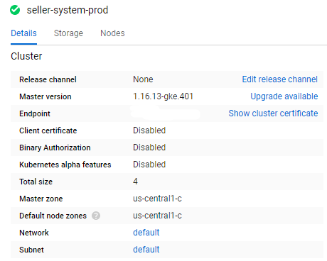
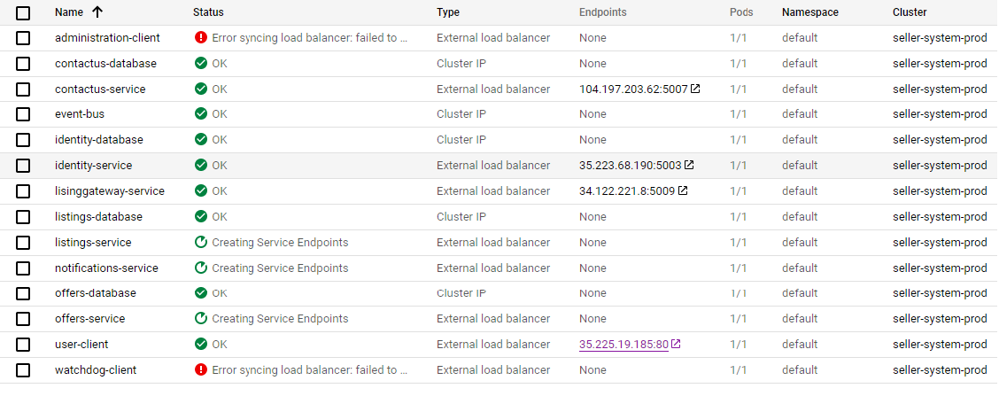
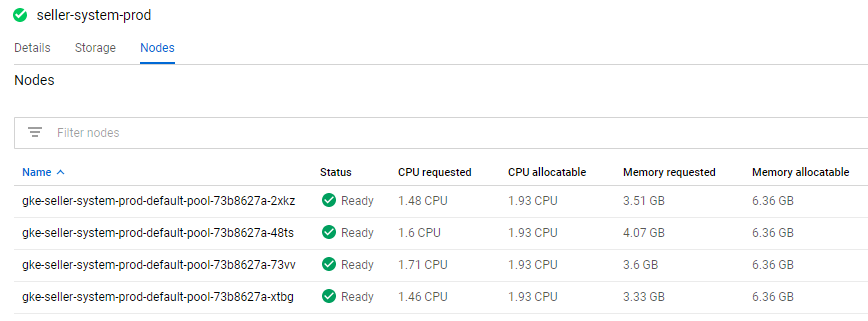
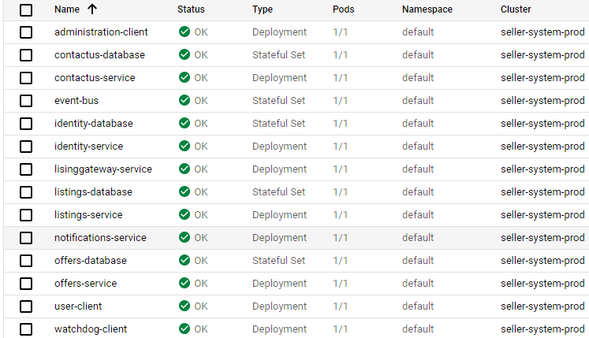
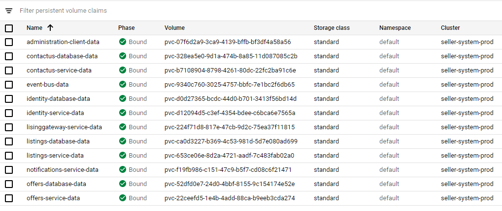
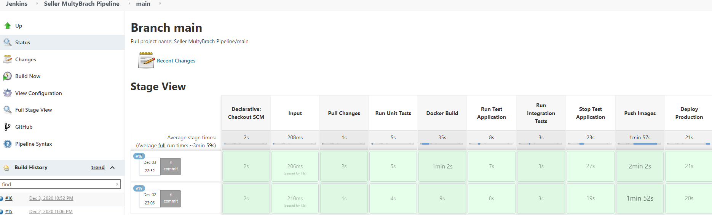

# Process-Automation-ASP.NET-Microservices-App - Seller

#### ASP.NET Core Server + Angular Client + Jenkins + Kubernetes + Google Coloud

### The App is NO longer in GCloud due to end of Trial Period

### Seller APP Idea
This is **extreamly** simple app for Listing Properties on the market, make offers and make deal for them.

## App content

#### All Server and Client Apps were in Google Cloud.

- Clent App Angular - http://35.225.19.185:80
- Server Apps ASP.NET 3.1 - **9 Microservices**
	1. Seller.Admin - MVC only for Admin - **N/A (no IP)**
	2. Seller.Identity - Api with DB - Entity Asp.Net.USer - http://35.223.68.190:5003/index.html
	3. Seller.Listings - Api with DB - **N/A (no IP)**
		1. Entities - Seller : User, Lising, Deals and Messages from Masstransit
	4. Seller.Messages - Api with DB - Entity  Message - http://104.197.203.62:5007/index.html
	5. Seller.Offers - Api with DB - Entity Offer - **N/A (no IP)**
	6. Seller.Listings.Gateway - Api Gateway - http://34.122.221.8:5009/index.html
	7. Seller.Notifications - Api - **N/A (no IP)**
	8. Seller.watchdog - Api - AppHealth - **N/A (no IP)**
	9. Seller.Shared - Library
	
### You were able to Access Only Client, Register on it and Send Message (Contact Us - section in menu).

## The app was published in Google Cloud

### The APP was not fully functional it needed 9 IPs only got 4 at the time from GCloud (Trial period).

### Nods were OK

### Workloads were OK

### Storage was OK

## The App has CI and CD with Jenkins

## App functionality

#### Not Logged User can do
1. **/** - See Landing page
2. **Login** - *on Post* direct Call login User
3. **Register** - *on Post* Multy Call to IdentityMS to Register User and ListingsMS to Create Seller : User **First Registered user is Admin**

#### Logged User can do
1. **See All Lisings** - *on Get* Direct Call to Listing MS, Search - Client implementation
2. **See Mini Lisings** - *on Get* Direct Call to Listing MS, Search - Client implementation
3. **Add Listing** - *on Post* Direct Call to Listing MS and**Using Messaging** to send message to NotificationsMS Using SingleR
		notify the Client and all Logged User about that new listing is published.
4. **Lising Deatails** - *on Get* See details Milty Call *from Client to LisingMS* and  *from Client OffersMS* to get offersCount
		
	-  If User **is Owner** of listing
		
	1.  **See all offers** - *on Get* Call to **Lising.Gateway** ot agregete data from OffersMS And LisingMS
				**Accept**	*on Post* direct call To LisingsMS to crete Deal and set Lising.IsDeal to true and
				**Using Messaging** call to OfferMS to set this IsAccepted to true to all other offer IsDeleted to True
				
	2.  **Edit Lising** - *on Get* - Direct Call to LisingMS, *on Post* Direct Call edit Lising and,
			**Using Messaging** if Title is changed to *Consumer - OffersMS* (*offer title = listing title* if there are offers change thеir title)
			
	3.  **Delete Lising** - *on Post* Direct Call edit Lising and, **Using Messaging** to set Offers.IsDeleted all associated with this listing 
			to true - soft delete
			
	- If User **is not Owner** of listing - **Add Offer** - *on Post* Direct Call to OffersMS
5. **Mine Offers** - *on Get*  Call To **Lisings.Gateway** to aggregate data from  *LisingMS and OffersMS*
		- **Deatails** - see listing details;
		- **Delete** - *on Post* Set IsDeleted to true
6. **Mine Deals** - *on Get*  Call To **Lisings.Gateway** to aggregate data from  *LisingMS Buy Deals And Sale Deals Service*
		and see all Bought Properties and all Sold Properties
7. **Contact Us** - *on Post* irect call to Seller.Messages send message to site administrator 
8. **Logout** - Clent delete token from Localstorage 
	
#### Admin can do
1. Can login in **AdminMS** *on get* Direct call to MessageMS see all sent messages from users and archive them on *on Post* direct call.

## Known Kubernetes Issues : when runned Localy
1. Seller.watchdog has problem conecting to RabbitMQ endpoint issue, need to be fixed.

## Known DOCKER Issues
1. **DOKER issue** outside doker works **Great** - in Microsoft.AspNetCore.Http.HttpContext(context) - context.Request.Cookies[CookieName] - can **not get** Token from Cookie - **added workaround** to keep token state
2. Masstransit messaging **working as intended** - If Lising is updated and OffersMS is down coresponding offers for the listing are Not updateted, when OffersMS comes up again coresponding offers are automatically updated. **But** in Messages Entity - IsPublished property is **always true !?**.
		